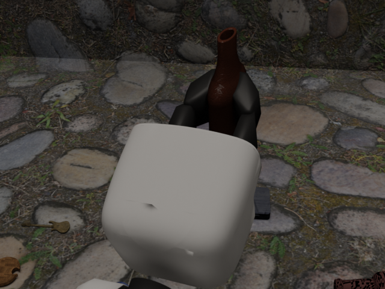
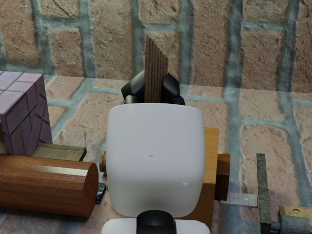
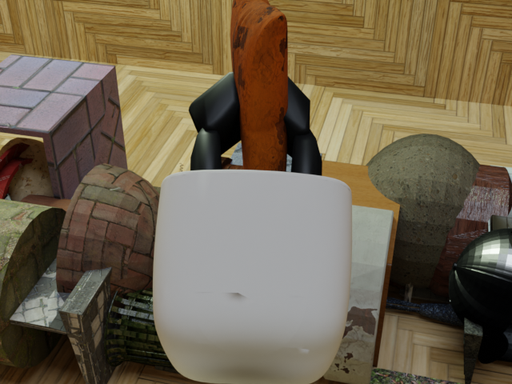
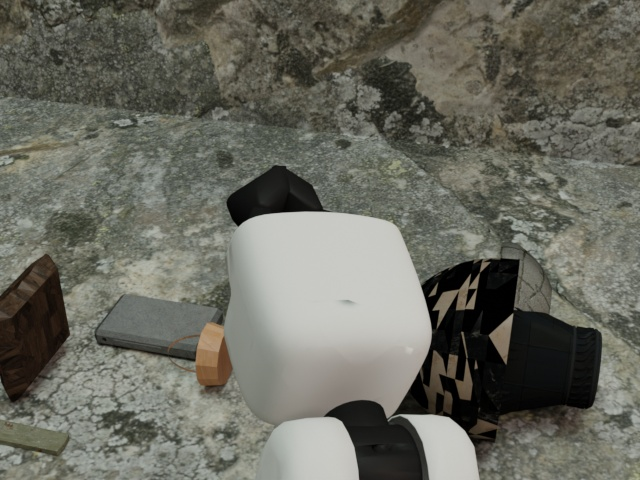
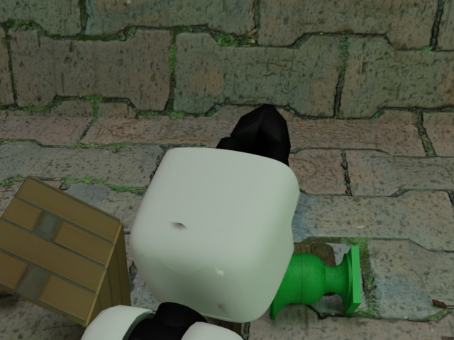
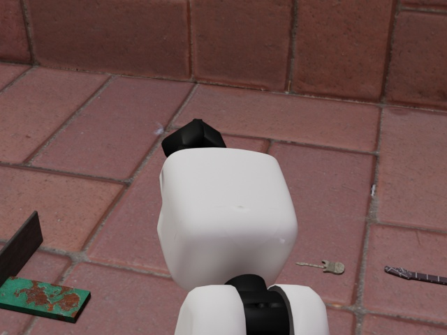

<h1 align="center">
Sim2Real Transfer for Vision-Based Grasp Verification
</h1>

<h3>
<a href="https://github.com/pauamargant">Pau Amargant</a>,
<a href="https://github.com/hoenigpeter">Peter Hönig</a>,
<a href="http://github.com/v4r-tuwien">Markus Vincze</a>,
 
 
</h3>

  
  
  
   
  
  
  

# Datasets

# GraspCheckNet Model